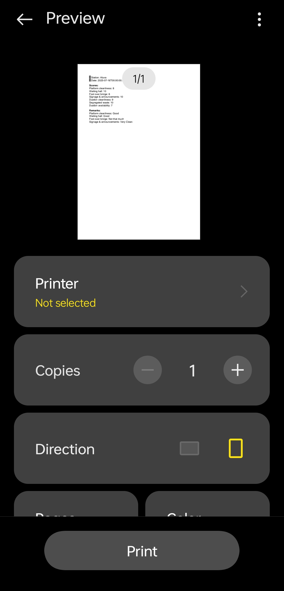

# 🚆 Clean Train Station Scorecard App

A Flutter application for conducting digital inspections of train stations based on cleanliness and hygiene standards. Built as part of an assignment.

---

## 🛠️ Project Setup Instructions

### Requirements
- Flutter SDK (version 3.x recommended)
- Dart SDK
- Android Studio or VS Code with Flutter plugin
- A connected device or emulator

## 📲 Screenshots

| Home Screen | Scorecard Form | Scorecard Preview |
|-------------|----------------|-------------------|
|  |  |  |

| View Scorecards | PDF Preview | Dark Mode |
|-----------------|-------------|------------|
|  |  |  |

---

### Steps to Run
1. **Clone the Repository**
   ```bash
   git clone https://github.com/yourusername/scorecard_app.git
   cd scorecard_app

2. **Install Dependencies**
    ```bash
    flutter pub get

3. **Add Assets**
    Make sure pubspec.yaml includes the background images:
    ```bash
        flutter:
        assets:
            - assets/your-image-name.jpg   

    **Note** - Place your image in the assets/ folder if it doesn’t exist.        

4. **Run the App**
    ```bash
    flutter run         
    

## ✨ Key Features Implemented       
1. **Multi-section Scorecard Form**
    Allows users to fill cleanliness-related scores (0–10) with remarks for each section such as:
       -  Dustbins
       - Toilets
       - Platforms
       - Track area
       - Waiting rooms

2. **Form Validation & Preview**
    Validates user input and shows a preview before submission.

3. **Local Storage of Submissions**
    Uses SharedPreferences to save scorecards locally.  

4. **Scorecard History Viewer**
    - View all past submissions
    - Swipe to delete individual entries
    - Delete all scorecards with confirmation
    - Undo last deletion            

5. **Generate & Preview PDF**
    - Dynamically generate a PDF of all stored scorecards
    - Open preview with a single tap

6. **Dark Mode Support**
    Toggle between light and dark themes using a switch on the home screen    


## 📌 Assumptions and Known Limitations 

## Assumptions
    - Each scorecard entry contains:
    - Date of inspection
    - Station name
    - Category-wise scores and remarks
    - Users manually enter correct and complete information
    - The app is used by inspectors with basic mobile usage familiarity

## Known Limitations
    ❌ No Cloud Sync: Data is stored only locally. If the app is deleted, data is lost.
    ❌ No Authentication: Any user can use the app; there's no login or role-based access.
    ❌ No Export/Share for PDF: The generated PDF can only be previewed for now.
    (But it will be saved in Local File Manager in your device and share it from there)
    ❌ Only English Language Support


## 📧 Author
Prathul K M

    ✉️ prathulkm@gmail.com

🔗 GitHub Profile

    https://github.com/Pr4thC0des
